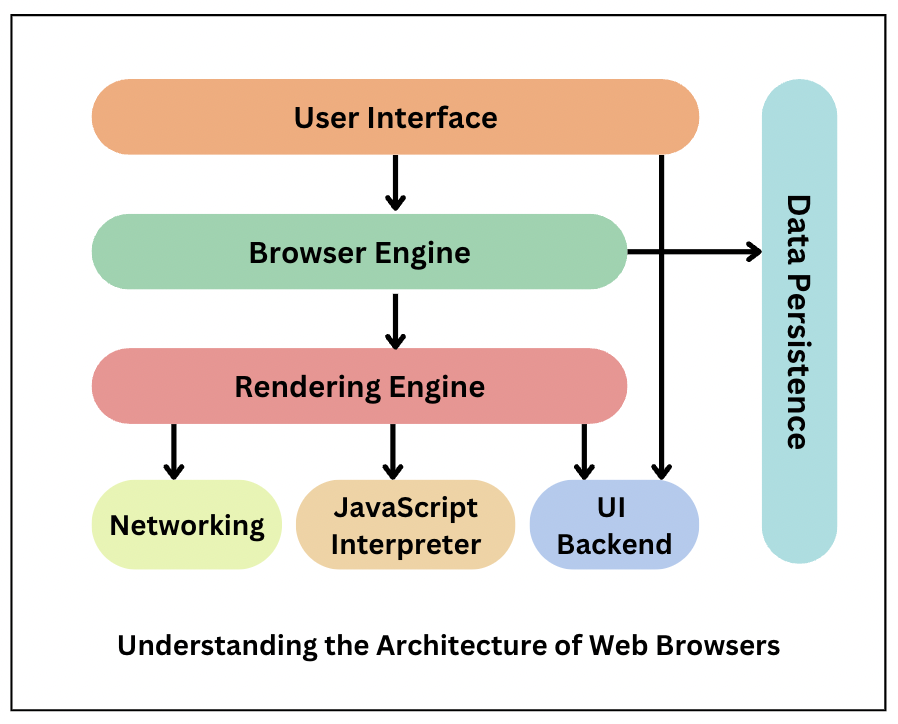
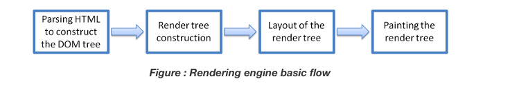

# como funciona internet?

## introduccion

una red es un grupo de computadores u otros dispositivos que estan 
conectados entre si 

## como funciona internet una vision general

internet funciona conectando dispositivos y sistemas informaticos entre si mediante un conjunto de protocolos estandarizados
que define como se intercambia la informacion entre dispositivos y garantizan que los datos se transmitan de forma fiable y segura

cuando se envia datos a traves de internet se dividen en pequeños paquetes que se envian desde su dispositivo a un enrutador 
el router examina el paquete y lo reenvia al siguite router

para garantizar el envio de paquetes se utilian varios protocolos de internet (IP) y protocolo de control de transmision (TCP) 
## que es un protocolo
es un conjunto de reglas y estandares que definen comos e intercambia la informacion entre dispositivos y sistemas

IP: envia y enruta los paquetes a su destino correcto
TCP: hace que los paquetes se transmita de manera confiable y en orden correcto

otros protocolos importates
DNS: sistema de nombre de dominio
HTTP: protoco de transferencia de hipertexto
SSL/TLS: secure sockest layer / Transport layer segurity

## El papel de los protocolos en Internet
Los protocolos desempeñan un papel fundamental a la hora de permitir la comunicación y el intercambio de datos a través de Internet.

IP: envia y enruta los paquetes a su destino correcto
TCP: hace que los paquetes se transmita de manera confiable y en orden correcto
DNS: sistema de nombre de dominio
UDP: Protocolo de datagramas de usuario

## Conceptos basico y terminologia

- Paquete: Pequeña unidad de datos que se transmite a través de Internet.
- Enrutador: Un dispositivo que dirige paquetes de datos entre diferentes redes.
- Dirección IP: Un identificador único asignado a cada dispositivo en una red, utilizado para enrutar datos al destino correcto.
- Nombre de dominio: Un nombre legible que se usa para identificar un sitio web, como google.com.
- DNS: El Sistema de Nombres de Dominio se encarga de traducir los nombres de dominio en direcciones IP.
- HTTP: El protocolo de transferencia de hipertexto se utiliza para transferir datos entre un cliente (como un navegador web) y un servidor (como un sitio web).
- HTTPS: Una versión cifrada de HTTP que se utiliza para proporcionar una comunicación segura entre un cliente y un servidor.
- SSL/TLS: Los protocolos de seguridad Secure Sockets Layer y Transport Layer se utilizan para proporcionar una comunicación segura a través de Internet.

## Descripción de las direcciones IP y los nombres de dominio

son conceptos importantes que hay que entender cuando se trabaja con internet

IP es un indentificador unico asignado a cada dispositivo de una red
se utiliza para enrutar los datos al destino correcto
IP suelen representarse como una serie de cuatro números separados por puntos, como "192.168.1.1".

Los nombres de dominio, por otro lado, son nombres legibles por humanos que se utilizan para identificar sitios web y otros recursos de Internet. Por lo general, se componen de dos o más partes, separadas por puntos. Por ejemplo, "google.com"

## Introducción a HTTP y HTTPS

HTTP (Protocolo de transferencia de hipertexto) y HTTPS (HTTP seguro) son dos de los protocolos más utilizados en aplicaciones y servicios basados en Internet.

HTTP es el protocolo utilizado para transferir datos entre un cliente (como un navegador web) y un servidor (como un sitio web). Cuando visita un sitio web, su navegador web envía una solicitud HTTP

HTTPS es una versión más segura de HTTP, que encripta los datos que se transmiten entre el cliente y el servidor mediante el cifrado SSL/TLS

## Creación de aplicaciones con TCP/IP

TCP/IP (Protocolo de control de transmisión/Protocolo de Internet) es el protocolo de comunicación utilizado por la mayoría de las aplicaciones y servicios basados en Internet. Proporciona una entrega de datos fiable, ordenada y con comprobación de errores entre aplicaciones que se ejecutan en diferentes dispositivos.

Al crear aplicaciones con TCP/IP, hay algunos conceptos clave que se deben entender:
- Puertos: Los puertos se utilizan para identificar la aplicación o el servicio que se ejecuta en un dispositivo.
- Sockets: Un socket es una combinación de una dirección IP y un número de puerto, que representa un punto final específico para la comunicación. Los sockets se utilizan para establecer conexiones entre dispositivos y transferir datos entre aplicaciones.
- Conexiones: Se establece una conexión entre dos enchufes cuando dos dispositivos quieren comunicarse entre sí. 
- Transferencia de datos: Una vez que se establece una conexión, los datos se pueden transferir entre las aplicaciones que se ejecutan en cada dispositivo.

## Protección de la comunicación por Internet con SSL/TLS

Como hemos comentado anteriormente, SSL/TLS es un protocolo utilizado para cifrar los datos que se transmiten a través de Internet. Se usa comúnmente para proporcionar conexiones seguras para aplicaciones como navegadores web

Al utilizar SSL/TLS para proteger la comunicación por Internet, hay algunos conceptos clave que hay que entender:
- Certificados: Los certificados SSL/TLS se utilizan para establecer la confianza entre el cliente y el servidor
- Apretón de manos: Durante el proceso de protocolo de enlace SSL/TLS, el cliente y el servidor intercambian información para negociar el algoritmo de cifrado y otros parámetros para la conexión segura.
- Encriptación: Una vez que se establece la conexión segura, los datos se cifran mediante el algoritmo acordado y se pueden transmitir de forma segura entre el cliente y el servidor.

## Que es HTTP?
es el protocolo de informacion que se utiliza para transgferir informacion en la web
- Metodos de solicitud
  - GET: Recupera datos del servidor.
  - POST: Envía datos al servidor para crear o actualizar recursos.
  - PUT: Actualiza completamente un recurso en el servidor.
  - DELETE: Elimina un recurso en el servidor.
  - HEAD: Recupera los encabezados de una respuesta sin el cuerpo.
  - OPTIONS: Describe las opciones de comunicación para el recurso objetivo.
  - PATCH: Aplica modificaciones parciales a un recurso.
### Código de estado HTTP: Cada respuesta del servidor incluye un código de estado que indica el resultado de la solicitud. Algunos ejemplos comunes son:

- 200 OK: La solicitud ha sido exitosa.
- 404 Not Found: El recurso solicitado no se ha encontrado.
- 500 Internal Server Error: El servidor encontró un error inesperado.

URLs (Uniform Resource Locators): HTTP utiliza URLs para identificar recursos en la web.

Encabezados (Headers): Las solicitudes y respuestas HTTP contienen encabezados que proporcionan información adicional sobre la solicitud o la respuesta.

### Ciclo de una solicitud HTTP:
- Cliente: Un navegador web u otra aplicación hace una solicitud HTTP.
- Servidor: El servidor web recibe la solicitud y procesa la información solicitada.
- Respuesta: El servidor envía una respuesta HTTP de vuelta al cliente con el contenido solicitado o un mensaje de error si la solicitud no pudo ser procesada.

## nombre de un dominio 

un localizador uniforme de recursos (URL) contiene el nombre de dominio de un sition asi como otra informacion incluido el protocolo y la ruta por ejemplo: 

https://cloudflare.com/learning/

cloudflare.com : es el nombre del dominio
https: es el protocolo
/learning/: es la ruta de la pagina

## que es el hosting
El hosting, también conocido como alojamiento web, es un servicio que permite a individuos y organizaciones almacenar sus sitios web, aplicaciones y otros contenidos en servidores conectados a Internet.
tipos de hosting:

- Hosting compartido: Varios sitios web comparten los recursos de un mismo servidor.
- Hosting VPS (Servidor Privado Virtual): Un servidor se divide en varias máquinas virtuales, cada una con sus propios recursos.
- Hosting dedicado: Un servidor completo se dedica a un solo cliente, proporcionando el máximo control y recursos.
- Hosting en la nube: Utiliza múltiples servidores conectados para proporcionar un servicio flexible y escalable.
- Hosting administrado: Incluye servicios adicionales de administración y mantenimiento del servidor.

## ¿Qué es el DNS y cómo funciona?
El Sistema de Nombres de Dominio es un sistema que traduce los nombres de dominio legibles por humanos (como www.google.com) en direcciones IP numéricas que las computadoras utilizan para identificar y comunicarse entre sí en la red. 
- Consulta del Usuario: Cuando escribes un nombre de dominio en tu navegador web (por ejemplo, www.google.com), el navegador envía una consulta DNS para encontrar la dirección IP correspondiente a ese dominio.
- Servidor Resolver: La consulta se envía a un servidor DNS resolver (resolver DNS), que generalmente es proporcionado por tu proveedor de servicios de Internet (ISP).
- Caché Local: El resolver DNS primero verifica si la dirección IP solicitada está almacenada en su caché local. Si la dirección está en la caché, el resolver devuelve la dirección IP al navegador.
- Consulta Recursiva: Si la dirección IP no está en la caché, el resolver DNS realiza una serie de consultas recursivas para encontrar la dirección IP correcta. Este proceso implica varias etapas:
    - Servidor Raíz: El resolver consulta un servidor raíz del DNS, que proporciona la dirección de un servidor de nombres de dominio de nivel superior (TLD) correspondiente (.com, .org, etc.).
    - Servidor TLD: El resolver consulta el servidor TLD, que proporciona la dirección de un servidor autoritativo para el dominio específico (ejemplo.com).
    - Servidor Autoritativo: Finalmente, el resolver consulta el servidor autoritativo, que tiene la dirección IP exacta del nombre de dominio solicitado.
- Respuesta: Una vez que se encuentra la dirección IP, el resolver DNS devuelve la dirección al navegador.
- Conexión: El navegador utiliza la dirección IP para conectarse al servidor web del dominio y solicitar la página web correspondiente.
- Caché Temporal: Para mejorar la eficiencia y reducir el tiempo de consulta en el futuro, la dirección IP se almacena temporalmente en la caché del resolver DNS y del navegador.

## Navegadores y como funcionan
El navegador es fundamental en el funcionamiento de cualquier sitio web. Desde cómo se renderiza la aplicación hasta cómo funciona, todo depende del navegador y su funcionamiento. 

#### Descripción de la arquitectura de los navegadores web
Los navegadores se componen de FrontEnd y BackEnd. Mientras que el frontend garantiza cómo aparece la página web en el navegador, el backend gestiona las solicitudes y es el portador de la información

- Interfaz de usuario
- Motor del navegador
- Motor de renderizado
- Gestión de redes
- Intérprete de JavaScript
- Backend de la interfaz de usuario
- Persistencia de datos

## Componentes del navegador web
Los navegadores web constan de 7 componentes diferentes que se enumeran a continuación:

1. Interfaz de usuario Este componente permite a los usuarios finales interactuar con todos los elementos visuales disponibles en la página web
2. Motor del navegador es un componente central de todos los navegadores web. El motor del navegador funciona como un intermediario o un puente entre la interfaz de usuario y el motor de renderizado. Consulta y maneja el motor de renderizado según las entradas recibidas de la interfaz de usuario.
3. Motor de renderizado Como su nombre indica, este componente se encarga de renderizar una página web específica solicitada por el usuario en su pantalla. Interpreta documentos HTML y XML junto con imágenes con estilo o formato CSS, y se genera un diseño final
4. Trabajo en red Este componente se encarga de gestionar las llamadas de red mediante protocolos estándar como HTTP o FTP. También se ocupa de los problemas de seguridad asociados con la comunicación por Internet.
5. Intérprete de JavaScript Como su nombre indica, es responsable de analizar y ejecutar el código JavaScript incrustado en un sitio web
6. Respaldo de la interfaz de usuario Este componente utiliza los métodos de interfaz de usuario del sistema operativo subyacente. Se utiliza principalmente para dibujar widgets básicos (ventanas y cuadros combinados).
7. Almacenamiento/persistencia de datos Es una capa persistente. Un navegador web necesita almacenar varios tipos de datos localmente, por ejemplo, cookies. Como resultado, los navegadores deben ser compatibles con mecanismos de almacenamiento de datos como WebSQL, IndexedDB, FileSystem, etcétera.
   
## Función del motor de renderizado
Una vez que un usuario solicita un documento en particular, el motor de representación comienza a obtener el contenido del documento solicitado

Los cuatro pasos básicos incluyen:

El motor de representación analiza la página HTML solicitada en fragmentos, incluidos los archivos CSS externos y los elementos de estilo. A continuación, los elementos HTML se convierten en nodos DOM para formar un "árbol de contenido" o "árbol DOM".

Al mismo tiempo, el navegador también crea un árbol de renderizado. Este árbol incluye tanto la información de estilo como las instrucciones visuales que definen el orden en el que se mostrarán los elementos. El árbol de representación garantiza que el contenido se muestre en el orden deseado.

Además, el árbol de renderizado pasa por el proceso de diseño. Cuando se crea un árbol de renderización, los valores de posición o tamaño no se asignan. Todo el proceso de cálculo de valores para evaluar la posición deseada se denomina proceso de diseño. En este proceso, a cada nodo se le asignan las coordenadas exactas. Esto garantiza que cada nodo aparezca en una posición precisa en la pantalla.

El paso final es pintar la pantalla, en la que se recorre el árbol de renderizado y se invoca el método paint() del renderizador, que pinta cada nodo de la pantalla utilizando la capa de backend de la interfaz de usuario.